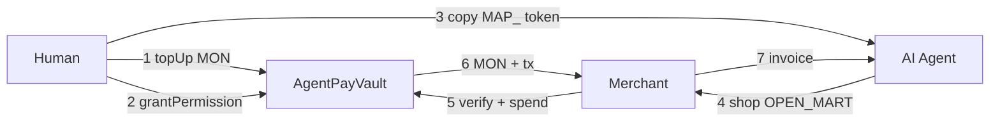

# SattelR

**Prepaid spend permissions for AI agents**, settled on [Monad](https://www.monad.xyz).

Agents can shop. A full wallet is unsafe. SattelR sits in the middle: top up **MON**, mint a restricted **agent token**, hand it to Grok / Hermes — never your private key.

> Like a prepaid card with rules: budget · category · websites · expiry · single-use. Settlement on Monad.

---

## Pitch checklist (say these out loud)

| | Link |
| --- | --- |
| **Repo** | https://github.com/Harsh854-22/SattelR |
| **Live URL** | https://sattel-r.vercel.app |
| **Contract** | `0x3d63a735225e4Ab159039fB9048E7408f7A35bf2` |
| **Deployed on** | Monad Testnet **and** Monad Mainnet |

---

## Live links

| | |
| --- | --- |
| Landing | https://sattel-r.vercel.app |
| Dashboard (top up + mint) | https://sattel-r.vercel.app/dashboard |
| OPEN_MART (agent checkout) | https://sattel-r.vercel.app/merchant |
| Invoices | https://sattel-r.vercel.app/invoices |
| Testnet contract | [MonadVision](https://testnet.monadvision.com/address/0x3d63a735225e4Ab159039fB9048E7408f7A35bf2) |
| Mainnet contract | [MonadVision](https://monadvision.com/address/0x3d63a735225e4Ab159039fB9048E7408f7A35bf2) |
| Verified source | Sourcify `exact_match` on both explorers |

---

## How it works



1. Human tops up the vault with MON  
2. Human mints a policy token (`grantPermission`)  
3. Agent receives `MAP_…` (permission, not a key)  
4. Agent shops at OPEN_MART → **AGENT** pay → paste token  
5. On-chain `spend()` enforces rules and pays the merchant  
6. Invoice returns with Monad tx hash  

**On-chain functions:** `topUp` · `grantPermission` · `spend` · `revokePermission` · `withdraw` · views (`getPolicy`, `vaultBalance`, …)

---

## Demo (5 minutes)

1. Open [dashboard](https://sattel-r.vercel.app/dashboard)  
2. Top up testnet MON ([faucet](https://faucet.monad.xyz))  
3. Generate token: `electronics` · `trusted-gadgets.example` · `$5`  
4. Copy prompt → paste into Grok / Hermes, **or** `npm run bot -- MAP_…`  
5. Agent buys on [OPEN_MART](https://sattel-r.vercel.app/merchant) → invoice + live tx  

Example testnet txs: [topUp](https://testnet.monadvision.com/tx/0x2aadb26278b5dd90ab3adcc5cfaca45bf5b511826657e160b2da790c4882c2f9) · [grant](https://testnet.monadvision.com/tx/0x0d99a0ba5c099a96b8f413504d201e474b4192cc408cfa463b79fa28198bc7ce) · [spend](https://testnet.monadvision.com/tx/0x4765ef417ff93ebb225fab8b74dfd17687549fb17e6a113aad43b6a5c62c0ed4)

---

## Contract

Same address on both chains (CREATE at nonce `0`).

| | Testnet | Mainnet |
| --- | --- | --- |
| Chain ID | `10143` | `143` |
| Address | [`0x3d63…3bf2`](https://testnet.monadvision.com/address/0x3d63a735225e4Ab159039fB9048E7408f7A35bf2) | [`0x3d63…3bf2`](https://monadvision.com/address/0x3d63a735225e4Ab159039fB9048E7408f7A35bf2) |
| Deploy tx | [`0xbb49…283f`](https://testnet.monadvision.com/tx/0xbb49b333fdb2d5a57e41bfddabbf7a3b168481eafdad926258614e180534283f) | [`0x359f…5d71`](https://monadvision.com/tx/0x359f3029a763ef3ea3f25ef7ba15db46d4295117cb34bf1a101d7aece1565d71) |
| Verified | Sourcify exact_match | Sourcify exact_match |

Source: [`contracts/src/AgentPayVault.sol`](./contracts/src/AgentPayVault.sol) · Notes: [`contracts/DEPLOYMENT.md`](./contracts/DEPLOYMENT.md)

```bash
cd contracts && forge test   # 12/12
```

---

## Run it yourself

```bash
git clone https://github.com/Harsh854-22/SattelR.git
cd SattelR
cp .env.example .env.local
npm install
npm run dev
```

Open http://localhost:3000 → **Open dashboard**.

Minimal `.env.local` (testnet only — never mainnet keys):

```env
NEXT_PUBLIC_MONAD_RPC_URL=https://testnet-rpc.monad.xyz
NEXT_PUBLIC_CHAIN_ID=10143
NEXT_PUBLIC_CONTRACT_ADDRESS=0x3d63a735225e4Ab159039fB9048E7408f7A35bf2
NEXT_PUBLIC_EXPLORER_URL=https://testnet.monadvision.com
NEXT_PUBLIC_OWNER_ADDRESS=0x1F3305F4d20F49c3505B5175d76A6619E4d00B38
NEXT_PUBLIC_AGENT_ADDRESS=0xF9fC21289921cAD9Cf546fF51800c3848dE64F45
OWNER_PRIVATE_KEY=          # testnet human / vault owner
DEMO_PRIVATE_KEY=           # testnet agent wallet (must match AGENT_ADDRESS)
DEMO_MERCHANT_ADDRESS=0x1F3305F4d20F49c3505B5175d76A6619E4d00B38
```

Agent bots:

```bash
npm run bot -- MAP_XXXX-XXXX-XXXX-XXXX
# optional Grok tool-calling:
GROK_API_KEY=… npm run bot:grok -- MAP_XXXX
```

Hosted API base: `SATTELR_API_URL=https://sattel-r.vercel.app npm run bot -- MAP_…`

---

## Judging map (non-social)

| Criterion | Covered by |
| --- | --- |
| Public GitHub repo | This repo |
| Proper README (live URL + contract) | Pitch checklist + Live links |
| Contracts on Monad Testnet | Deployed + verified |
| Publicly hosted | https://sattel-r.vercel.app |
| All announced functions working | `topUp` / `grantPermission` / `spend` + dashboard & merchant |
| Live tx during demo | Dashboard top-up / grant / OPEN_MART pay |
| Contract verified | Sourcify exact_match (testnet + mainnet) |
| Others can run from README | Run it yourself section |
| Mainnet deploy (bonus) | Same address on chain `143` |
| Pre-market fit / revenue / innovation | Policy tokens for safe agent commerce — see below |

**Not in this README:** X / LinkedIn posts, demo ads, view counts (your social submissions).

### Why this is needed

AI agents are becoming shoppers. Card rails and full wallets don’t fit machine-speed micropayments or scoped trust. SattelR is an open, self-hostable **policy + settlement** layer: humans keep control; agents get autonomy inside limits; Monad settles fast and cheap.

---

## Stack

Next.js 14 · viem · Foundry · Monad · optional Grok tool-calling

```text
app/          UI + API
bot/          shopping agents
contracts/    AgentPayVault
lib/          chain + policy helpers
```

## Credits

Monad Blitz — [Anurag](https://github.com/anurag-p6) · [Harsh Singh](https://github.com/Harsh854-22)

## License

MIT
